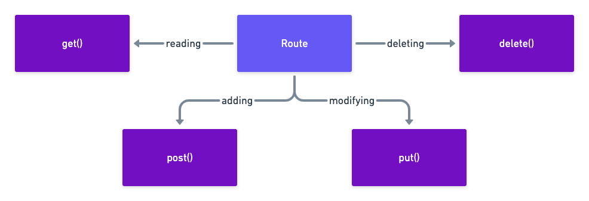

### How routing works (diagram)


### HTTP verb methods on Route class (diagram)


### Inside route definition file (routes/web.php)

Defining a route using closure

```php
Route::get('/', function () {
    return view('welcome');
});
```